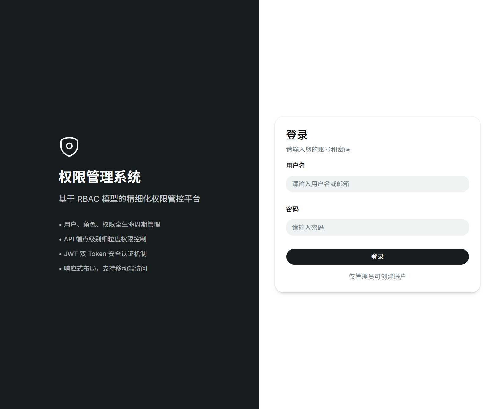
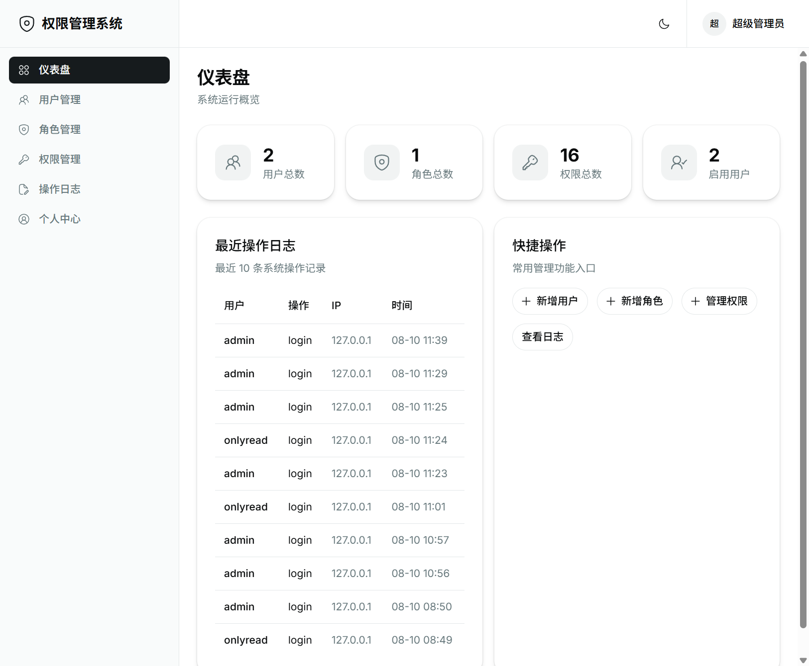
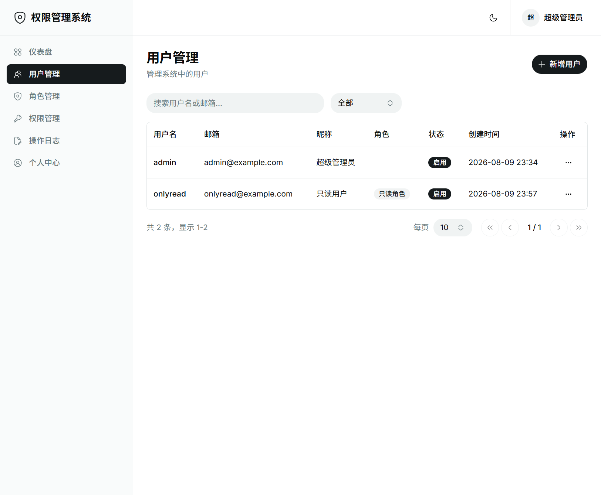
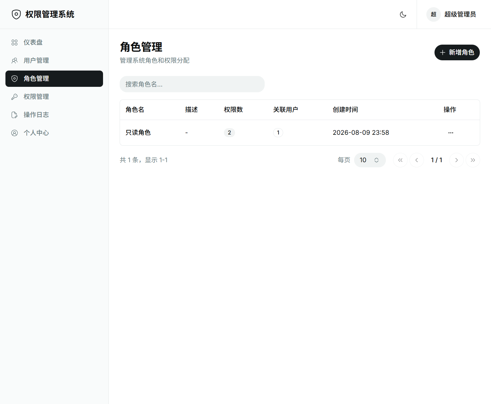
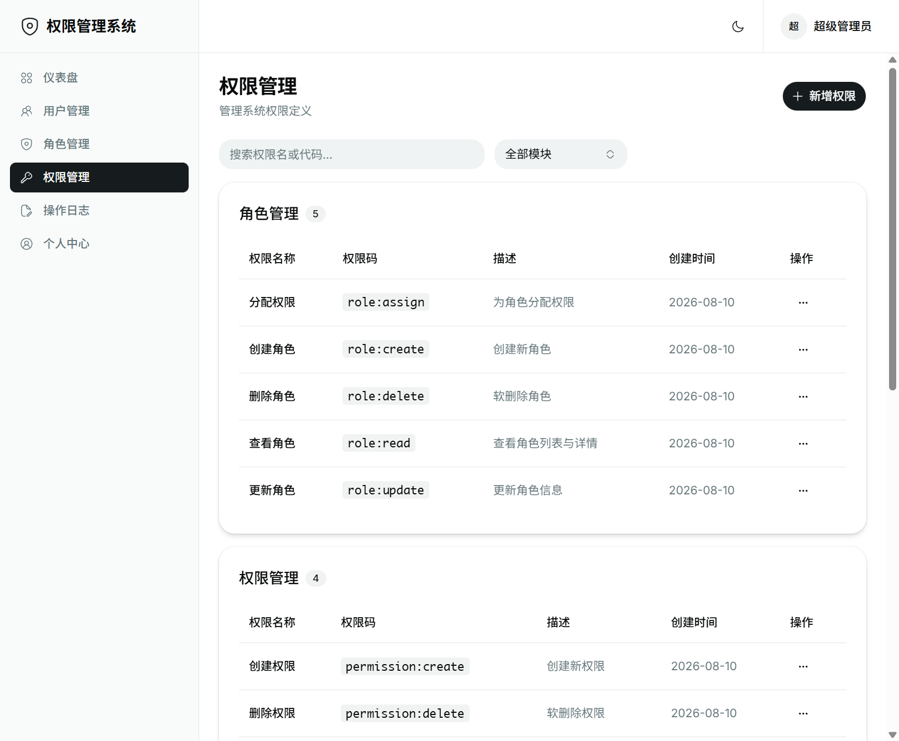
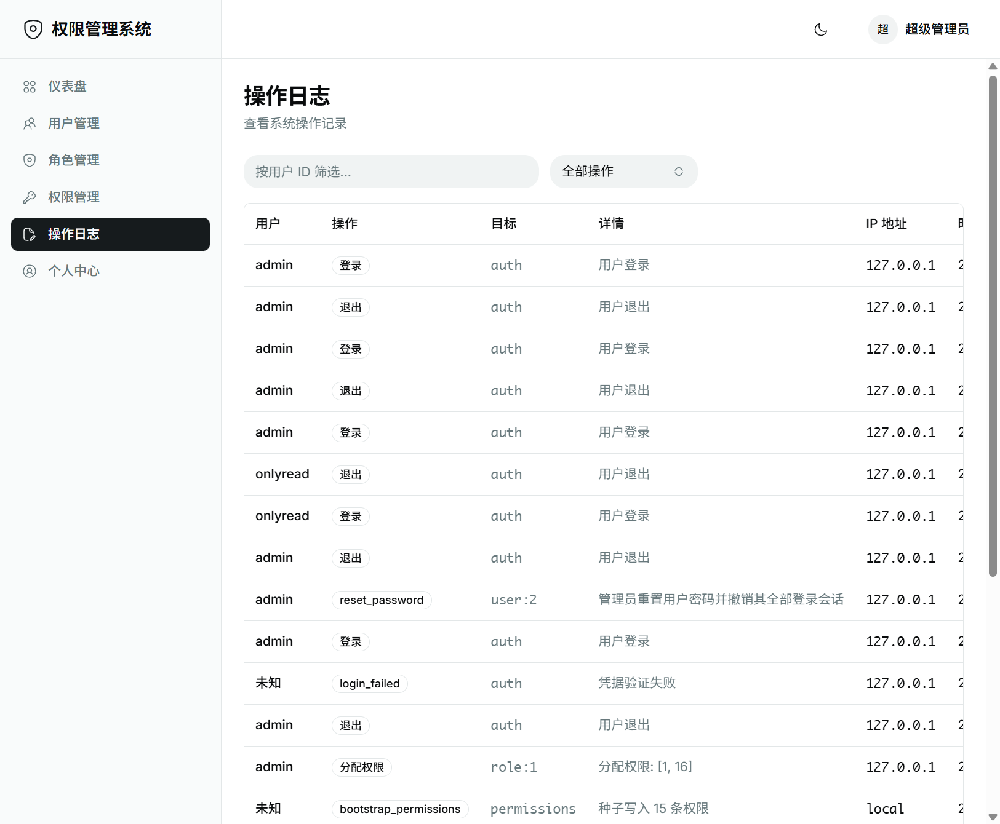

# fastapi-admin

[中文文档](./README_zh.md)

A full-stack **RBAC admin console** built with FastAPI and React. Manage users, roles, and permissions with JWT dual-token auth, revocable refresh sessions, and API-level permission checks.



## Screenshots

| Dashboard | Users |
| --- | --- |
|  |  |

| Roles | Permissions |
| --- | --- |
|  |  |



## Features

- **RBAC**: users ↔ roles ↔ permissions, soft delete, module-grouped permission codes (`user:read`, `role:assign`, …)
- **Auth**: Argon2id passwords, short-lived access tokens, HttpOnly refresh cookies, session-family rotation with replay revocation
- **API guards**: `require_permission("…")` on protected endpoints; `/me` returns a flat permission list for the UI
- **Admin UX**: dashboard, user/role/permission CRUD, role assignment, admin password reset, audit trail
- **Bootstrap**: Alembic migrations + `init_db.py` seeds the 16 system permissions (roles/assignments stay in the UI)

## Tech stack

| Layer | Stack |
| --- | --- |
| Backend | Python 3.14, FastAPI, SQLAlchemy 2 (async), PostgreSQL, Alembic, JWT, uv |
| Frontend | React 19, TypeScript, Vite, Tailwind CSS 4, shadcn/ui (Base UI), Zustand, React Router 7 |
| Quality | ruff, mypy, pytest / ESLint, Prettier, `tsc -b` |

## Repository layout

```text
fastapi-admin/
├── backend/          # FastAPI API (see backend/README.md)
├── frontend/         # React SPA (see frontend/README.md)
├── docs/             # PRD, architecture, deployment, screenshots
├── README.md         # English (this file)
└── README_zh.md      # Chinese
```

## Quick start

### Prerequisites

- Python **3.14**
- Node.js **≥ 18** (pnpm or npm)
- PostgreSQL **≥ 14** (`pg_trgm` extension recommended)
- [uv](https://github.com/astral-sh/uv)

### 1. Backend

```bash
cd backend
cp .env.example .env
# Edit DATABASE_URL and (for first bootstrap) INIT_SUPERUSER_*
uv sync
uv run alembic upgrade head
uv run python init_db.py
uv run python main.py
```

API: `http://localhost:8000` · OpenAPI: `http://localhost:8000/docs`

### 2. Frontend

```bash
cd frontend
cp .env.example .env
# VITE_API_BASE_URL=http://localhost:8000/api/v1
pnpm install   # or: npm install
pnpm run dev   # or: npm run dev
```

App: `http://localhost:5173`

Sign in with the superuser created by `init_db.py`, then create roles and assign permissions in the UI.

## Documentation

| Doc | Description |
| --- | --- |
| [docs/PRD.md](./docs/PRD.md) | Product requirements |
| [docs/ARCHITECTURE.md](./docs/ARCHITECTURE.md) | System design |
| [docs/DEPLOYMENT.md](./docs/DEPLOYMENT.md) | Production deployment |
| [backend/README.md](./backend/README.md) | Backend guide ([中文](./backend/README_zh.md)) |
| [frontend/README.md](./frontend/README.md) | Frontend guide ([中文](./frontend/README_zh.md)) |

## License

[MIT](./LICENSE) © lijianqiao
